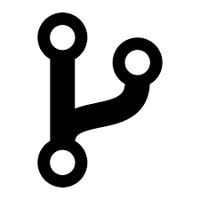

# TP2 - Utilisation Courante de Git - Concepts Clés
Pour ce deuxième TP, nous allons récupérer un projet opensource sur GitHub, le cloner, et travailler sur une branche pour ajouter une modification.

## 📥 Récupération d’un Projet sur GitHub

###  Forker un dépôt opensource: 
- Sur le site de GitHub, naviguez sur mon dépôt: https://github.com/alnI3S/workshopGitDocker
- Cliquez sur le bouton "**Fork**" pour créer une copie du dépôt dans votre compte GitHub.

**Note**: Pour synchroniser votre projet forké avec celui d'origine, GitHub dispose d'un bouton "**Sync fork**". Utile pour récupérer les récentes mises à jour du dépôt original.

### 🐑 Cloner votre dépôt forké:
Dans votre espace de travail neuf **autre que l'espace du TP1**, entrez cette commande pour cloner votre dépôt forké:
```
git clone https://github.com/<votre_nom_utilisateur>/workshopGitDocker.git

cd workshopGitDocker/
```
Vérifiez avec `git remote -v` que vous avez bien le lien entre les dépôts local - distant.

Maintenant vous avez une copie locale du dépôt forké. Votre projet local n'a aucun lien avec mon projet sur GitHub, seul votre projet forké sur GitHub a un lien vers le mien.

## Workflow typique d'un projet:
1) Vous souhaitez travailler en parallèle pour tester une nouvelle fonctionnalité ou corriger des bugs. Dans ce cas, vous pouvez créer une nouvelle branche avec `git checkout -b <nom_de_la_branche>` et travailler dans cette branche.
2) Quand votre nouvelle fonctionnalité est finalisée et que votre dépôt forké sur GitHub est à jour avec `git push`, vous souhaitez la proposer à la communauté. Dans ce cas vous faites une **Pull Request** depuis votre GitHub. Comme je suis le propriétaire du dépôt original, charge à moi d'accepter (ou non) vos modifications dans mon dépôt.
3) Si votre **Pull Request** est acceptée, vous pouvez mettre à jour votre dépôt forké avec **Sync fork** pour récupérer les modifications sur la branche `main` 
4) Puis vous pouvez supprimer la branche locale avec `git branch -d <nom_de_la_branche>` et `git push origin --delete <nom_de_la_branche>` pour supprimer la branche distante.

## 🔄 Gestion des Modifications
Ne modifiez jamais la branche `main` d'un dépôt dont vous n'êtes pas le propriétaire même si vous l'avez forké. Pour la mettre à jour, vous pouvez utiliser la fonctionnalité **Sync fork** de GitHub puis `git pull` en local pour récupérer les modifications.

### Mettre de côté les modifications (`git stash`)
- Pour sauvegarder temporairement vos modifications non commitées. Cela est utile lorsque vous devez basculer rapidement sur une autre branche sans commiter vos changements:
```
git stash
```
- Voir les sauvegardes temporaires:
```
git stash list
```
- Pour revenir à l'état avant la sauvegarde temporaire: appliquer la dernière sauvegarde temporaire:
```
git stash apply
```

###  Branches: 
On peut créer une nouvelle branche avec `git branch <new_branch>` ou `git checkout -b <new_branch>`. La premère vous laisse sur votre branche actuelle (`main`) alors que la deuxième bascule automatiquement sur la nouvelle branche.

#### Création d'une branche locale
Créez une nouvelle branche locale `dev` et basculez-y avec:
```
git pull                # util pour récupérer les modifications à distant
git checkout -b dev
```
A ce stade votre branch `dev` a le même état que la branche (`main`) dont elle est issue.

**Notes**:
1) voir les branches locales: `git branch`,
2) basculer sur une branche existante: `git checkout <branch_name>` ou (**Nouveau!**) `git switch <branch_name>`,
3) renommer la branche actuelle: `git branch -m <new_name>`,
    - renommer une branche: `git branch -m <old_name> <new_name>`,
    - renommer une branche distante: `git remote rename <current_name> <new_name>`.
4) créer une nouvelle branch avec les modificcations actuelles:
    ```
    git stash                   # sauvegarde les modifications actuelles    
    git checkout -b <new_branch>  # créer une nouvelle branche
    git stash apply             # restaure les modifications sauvegardées
    # validation avec git add et git commit
    ```
5) supprimer une branche locale: `git branch -d <branch_name>`,

### Modification du code: 
Modifiez le fichier `doc/2a_git&code.md` par exemple en y ajoutant à la fin:
```
Exercice:
Résumez les commandes de base de Git de ce TP en une liste à puces.
```

### Diff Tool:
Voir l'état du dépôt:
```
git status
```
Il y a en général 3 sections: 
- **Changes to be committed** (changements indexés) en <span style="color:green; font-weight:bold;">vert</span> contient les fichiers ajoutés avec `git add` mais pas encore committés,
- **Changes not staged for commit** (Changements) en <span style="color:red; font-weight:bold;">rouge</span> contient les fichiers modifiés mais as encore ajoutés avec `git add`,
- **Untracked files** en <span style="color:red; font-weight:bold;">rouge</span> contient les nouveaux fichier non indexés (pas encore `git add`).

Les commandes `git diff` et `git merge` sont des outils essentiels pour gérer les modifications et les conflits dans Git mais sont souvent difficiles à utiliser en ligne de commande si vous avez des gros fichiers ou des changements complexes. Nous avons configuré Code pour les outils `difftool` et `mergetool`. Pour voir les changements vous pouvez utiliser `difftool` en cliquant sur le menu latéral gauche **Control de code source (Ctsl + Maj + G)** puis section **Changements**. Voici quelques exemples d'utilisation de `difftool` "en semi-ligne de commande":
- voir les changements entre la version actuelle et la version précédente du fichier `doc/2a_git&code.md` sur la branche `main`: `git difftool <other_branch> -- <file_path>`:
    ```
    git difftool main doc/2a_git&code.md
    ```
- voir tous les changements: `git difftool <branch you want to check with>`:
    ```
    git difftool main
    ```

    Code va vous demander de confirmer l'ouverture de chaque fichier pour visualiser les changements.

Vous pouvez utiliser totalement avec l'interface graphique.

### Valider les changements
Nous avons vu dans le bonus du TP1 les commandes graphiques équivalents à `git add` et `git commit`. Nous allons les refaire ici (pour les sans bonus!)
- Allez dans le menu latéral gauche **Control de code source (Ctsl + Maj + G)** puis section **Changements**:
- Cliquez sur le bouton "**+**" de "**Changements**" pour **Mettre en attente** tous les fichiers ou cliquez seulement le bouton "**+**" du fichier que vous souhaiter **Mettre en attente**. 
    - Une nouvelle section **Changements indexés** apparaît avec les fichiers que vous avez cliqué sur le bouton "**+**". Et le bouton **Validation** devient disponible.
- Cliquez sur **Validation** pour committer vos changements. Code va vous proposer d'entrer un message de commit, faites-le puis enregistrez et cliquez sur le logo "**check**" en forme de "v" pour valider le commit.

### Sauvegarder une branche locale sur GitHub:
- Votre branche `dev` n'existe que localementMaintenant dans la section graphique une nouvelle étape apparaît. Envoyez votre branche locale sur votre dépôt GitHub en cliquant sur "**Publier la branche**".
    
    **Notes**:
    1) Publier une branche locale sur GitHub, la commande dans un terminal (CLI) est: `git push origin -u <branch_name>`,
    2) Supprimer une branch distante: `git push origin --delete <branch_name>`. Attention `origin` est le nom affiché par la commande `git remote -v`.

### Merge Tool: 
On va simuler un conflit "*divergent*" en modifiant le même fichier `doc/2a_git&code.md` en local et à distant:
1) Restez sur la branche `dev` et modifiez ce fichier en entrant un texte par exemple "test conflit: modifié en local".
2) Allez sur GitHub et **sélectionnez la branche `dev`** puis modifier le même fichier en entrant un autre texte par exemple "modifié sur GitHub.". Validez le changementen appuyant sur le bouton **Commit changes** puis dans la fenêtre qui s'ouvre, appuyez encore sur un **Commit changes**.

On va envoyer le changement local vers GitHub:
1) Validez votre changement en local (boutons **+**, **validation**, **check**)
2) Envoyez le changement local vers GitHub en appuyant sur **synchroniser les modifications**.
3) Dans le terminal, vérifiez le status et constatez que votre branche est divergée:
    ```
    git status
    ```
4) Si vous tentez de récupérer les changements distants, Git refuse car il y a des conflits:
    ```
    git pull
    ```
5) Suivez la consigne de Git pour la fusion:
    ```
    git config pull.rebase false
    git pull
    ```
6) Code ouvre automatique quement les fichiers en conflit un par un. Réglez le conflit en choisissant par exemple la version distante (sur GitHub) avec:
    - **Accepter la modification entrante**,
    - Cliquez sur **Résoudre dans l'éditeur de fusion**,
    - sélectiobbez **Accepter toutes les modifications entrantes..**. Observez le résultat dans la fenêtre dédiée en bas,
    - Cliquez sur **Terminer la fusion**,
    - Cliquez sur **Continuer**.

### Revenir en arrière 

#### Annuler un commit local

Supposons que la fusion précédente ne vous plaise pas. Vous pouvez annuler le dernier commit avec la commande `git reset`:
```
git status
git log
git reset HEAD~
```

#### Annuler un commit distant
Pour annuler le dernier commit:
```
git reset HEAD^
git push origin +HEAD
```
**Note**: annuler les 2 (ou plus) derniers commits: `git reset --hard HEAD~2`.

### (Bonus) Suppression de fichiers/dossiers non suivis
- Nettoyer les fichiers non suivis (en rouge après `git status`):
```
git clean -n    # affiche les fichiers qui seront supprimés
git clean -f    # force la suppression
```
- Supprimer les répertoires non suivis: 
```
git clean -ffxd
```
- Supprimer un fichier renommé non suivi:
```
git rm <file_to_delete_in_red>
git commit -m "rename/remove file"
```

## 📦 Gestion des Sous-Modules
Souvent dans les projets d'ampleur important il intègres plusieur modules tiers, ce sont des `submodule` en Git.
### Ajouter un sous-module
Si vous voulez juste utiliser un module sans le modifier, vous pouvez l'intégrer dans votre projet avec `git submodule add <repository> [<path>]`:

1) Ajouter un module de mesure Time Of Flight (TOF) de la puce TDC7201 de Texas Instruments dans le répertoire `submodules/TDC7201Term`:
```
git submodule add https://github.com/looninho/TDC7201Term.git submodules/TDC7201Term
```
2) Aller dans le répertoire du sous-module et vérifier la branche par défaut:
```
cd cd submodules/TDC7201Term/
git status
git remote -v
```
Maintenannt vous êtes dans un sous-répertoire qui se comporte comme un dépôt Git indépendant. Attention tout de même que le dépôt `origin` ne vous appartient pas donc ne rien mododifiez dedans.

**Note**: Si vous voulez récupérer les dernières modifications faites par le propriétaire du dépôt `origin`, utilisez `git pull` depuis le répertoire du sous-module.

### Modifier un sous-module
Si vous voulez modifier le code du sous-module, il convient d'ajouter un dépôt `upstream` (un fork sur GitHub qui vous appartient) pour récupérer les mises à jour du dépôt `origin` depuis GitHub et modifier le code comme nous avons fait dans ce TP2:
1) Sur gitHub, faire un **fork** du dépôt origine
2) Ajouter le lien `upstream` pour le module forké avec `git remote add upstream <url_forked_submodule>`. Attention pour les `pull`/`push` il faut préciser `upstream` comme `git pull upstream [<branch_name>]`, `git push upstream [<branch_name>]` parce que rien préciser est équivalent à `origin`.
3) Aller dans le répertoire du sous-module et vérifier:
    ```
    # cd path_to_submodule
    git remote -v
    git branch
    ```
4) Remplacer l'url ainsi que la branche du sous-module vers le vôtre dans le fichier `.gitmodules`
5) Vous pouvez créer une nouvelle branche et modifier le code comme on fait dans ce TP2.

### Supprimer un sous-module
Plusieurs étapes sont nécessaires pour supprimer un sous-module de votre dépôt Git. Voici comment procéder :
1) Supprimer le sous-module du fichier `.gitmodules`,
2) Supprimer le sous-module du fichier et du fichier `.git/config` en exécutant `git rm --cached submodules/TDC7201Term` sans le slash (/) final. Ce répertoire devient non-suivi.
3) Supprimer le répertoire du sous-module dans `.git/modules` avec `rm -rf .git/modules/submodules/TDC7201Term`
4) Mettre à jour votre dépôt (`git add`, `git commit`, `git clean`)
5) Supprimer le répertoire du sous-module avec `rm -rf submodules/TDC7201Term`.
